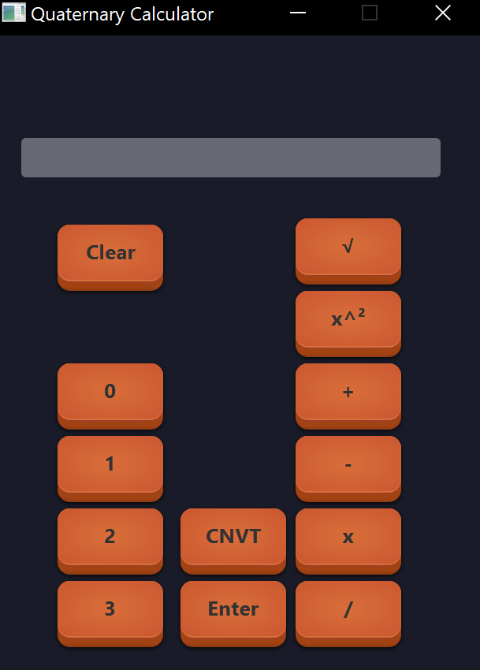

<h1 align="center">Quaternary Calculator</h1>

<strong>A Quaternary Calculator</strong>
 

## About

It's a Quaternary Calculator

## Manual

To use this quaternary calculator you enter a value, an operator sign, and another value. Then you hit enter. 
Hitting enter will display the result of the entered equation. You can click the clear button to reverse any accidental 
input.

## Goal and requirements

For this project we were assigned to groups and were given the task of creating a quaternary calculator.
A quaternary calculator is a calculator that works in base 4.

## Contributions
Chandler Clevenger = basic UI and button logic  
Robert Duncan = Underlying logic and tests  

## Meetings
### Meeting 1
Date/time - 9/8/22 at 6:30 - 8:30  
Attendees - Robert, Dawson  
Medium - Library  
What was discussed -   

### Meeting 2 
Date/time - 9/9/22  
Attendees - Robert, Dawson, Chandler  
Medium - Discord  
What was discussed - The project as a whole and finishing up  
